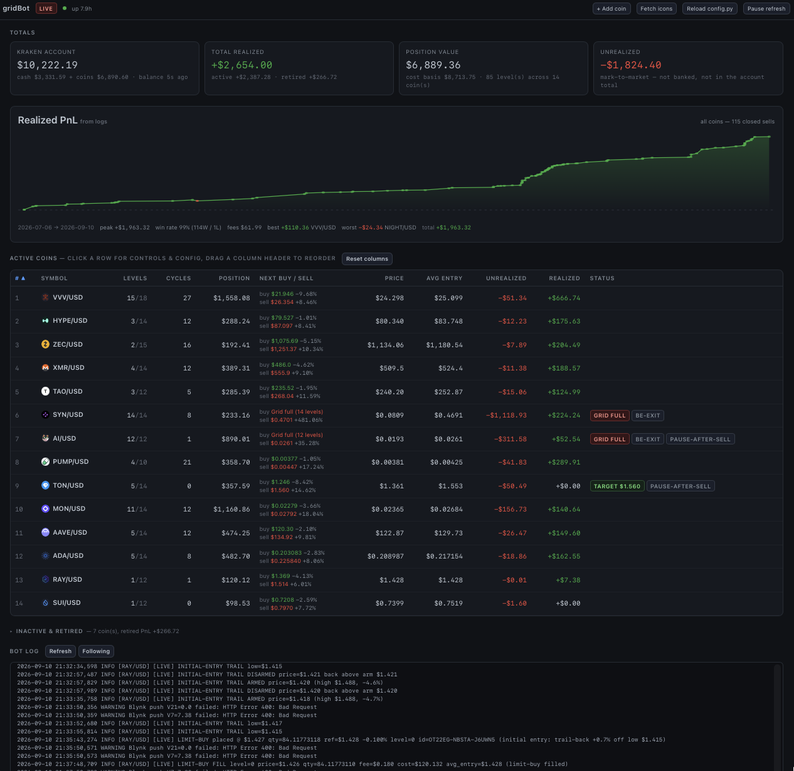
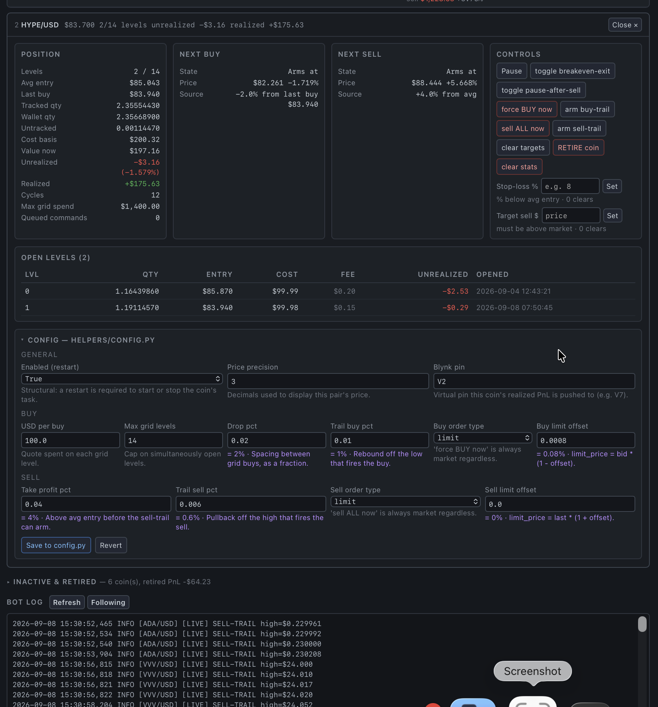

# CryptoBot

A bot that trades crypto based on grids. DCA essentially. It also uses Blynk (https://blynk.cloud) for posting total PnL to the app and Pushover (pushover.net) for notifications (push) such as buys, take profits, stop losses, etc.. It uses CCXT Pro WebSockets for pulling/pushing the info.  Each coin runs as its own asyncio task with its own price stream, state file and
trailing entry/exit state machines.  

#### Features

- Trading strategy: grid/DCA on Kraken across many coins at once, each with its own settings. It buys a dip on the rebound, adds more buys as price falls further, and sells the whole position on a pullback once it's in profit.

- Order types: buys and sells can each be market or maker-only limit orders, chosen per coin. Limit orders cancel themselves if price moves away.

- Modes: paper (the default), live, live dry-run, and replaying prices from a CSV. Paper mode has a real cash limit.

- Exits: a stop-loss that sells everything and pauses the coin, a breakeven exit that covers fees, a limit sell at your own price, and a manual sell-trail that never sells at a loss.

- Manual controls: pause trading, pause buying only, pause after the next sell, a one-off buy-trail, force buy or sell now, and clear targets or stats.

- Retire a coin: records its lifetime profit in a ledger so it still counts in your totals, then resets it.

- Safeguards: API calls go out one at a time so they can't collide, failed cancels are never lost track of, and partial fills are always recorded. Sells are limited to what's actually on Kraken, and holdings are matched to your Kraken balance at every startup.

- Terminal menu: pick a coin by number and act on it, with an all-coins summary table and a live settings reload.

- Web dashboard: account and profit totals, a profit-history chart, and a coin table with logos, status and next buy/sell prices. Each coin has a detail panel with grouped controls, and there's a settings editor that saves to config.py.

- Notifications: Pushover alerts on every sell, and Blynk gets total and per-coin profit.


#### ⚠️ This places orders with real money when run with `--live`


The default config has examples of several coins. They are only examples. Use this program with caution. If you don't know what you are doing you can lose money easily. I provide the software as is. What you do with it is all you.

I can't stress this enough:

#### <u>ALWAYS DO YOU DUE DILIGENCE... ALWAYS!</u>


<br></br>

### <u>How it trades</u>

One cycle, per coin:

1. **Wait for a dip.** Track the running high; arm once price falls `drop_pct` below it.
2. **Buy the rebound.** Follow the low down and buy when price bounces `trail_buy_pct`
   off it — a trailing entry, so it doesn't catch the first touch of a falling knife.
3. **Add levels.** Each further buy arms `drop_pct` below the *last* buy, up to
   `max_grid_levels` levels of `usd_per_buy` each.
4. **Take profit.** Once price reaches `avg_entry × (1 + take_profit_pct)`, arm a
   sell-trail; sell the **whole** position when price pulls back `trail_sell_pct`
   off the high.
5. Book realized PnL, tick the cycle counter, start over.

Buys and sells are market or post-only limit per coin (`buy_order_type` / `order_type`).

Beyond the base loop: hard stop-loss, breakeven exit, pause-after-sell, manual
target sell, manual buy/sell trails, and a ledger that keeps a retired coin's
lifetime PnL in the totals after its state is wiped.

<br></b>

##  Quick start 


1. Clone repo to your computer
```bash
git clone https://github.com/kritch83/cryptoBot.git && cd cryptoBot
```

2. Install python3
```bash
sudo apt install -y python3-dev python3-pip
```

3. Create virtual environment
```bash
python3 -m venv env && source venv/bin/activate
```

4. Install python & python libs
```bash
pip3 install -r helpers/requirements.txt
```

5. Copy example env to .env & fill in with your keys/info
```bash
cp env.example .env && nano .env
```

6. Edit the `COINS` list in `config.py` with your coins
```bash
nano helpers/config.py
```

7. Then run **from the project root** (all paths are relative to it) one of two commands:
<h5>paper mode:</h5>
```
python3 conductor.py
```
<h5>live mode:</h5>
```
python3 conductor.py --live
```


| Flag | Effect |
| --- | --- |
| *(none)* | Paper trading against live prices. The default. |
| `--live` | **Sends real orders.** Needs `KRAKEN_API_KEY` / `KRAKEN_API_SECRET`. |
| `--dry-run` | With `--live`: logs the orders it would send, sends nothing. |
| `--simulate FILE.csv` | Replay prices from a CSV (first enabled coin only). |
| `--no-dashboard` | Don't start the web dashboard. |
| `--dashboard-host` / `--dashboard-port` | Override the bind address / port. |

<br></b>

## <u> Dashboard </u>

###  To pull up web dashboard the first time  

http://[hostIP]:8787/?token=DASHBOARD_TOKEN; the token is kept in a cookie after the first visit.




- Account total (cash + coins + any other assets such as USDT, at market — real
  assets, no unrealized PnL), realized PnL, position value and unrealized as
  separate cards.
- Account value over time (1D / 1W / 1M / 3M / All), recorded every 10 minutes
  to `data/equity_history.jsonl`, with the period change and how much of it the
  bot banked.
- "Where the money is" donut (cash vs. each coin) and a coin-performance
  quadrant: realized (banked) vs. unrealized (holding now) per coin, dot size =
  position value. Click a slice or dot to open that coin.
- Realized profit today / last 7 days / last 30 days / best day, above the
  profit-history chart.
- Per-coin table: price, levels, avg entry, position value, unrealized, realized,
  cycles, next buy/sell with distance from current price, and status badges.
  Click a header to sort, drag one to reorder; the layout is remembered per browser.
- Click a row for its detail panel — position breakdown, open levels, the next
  buy/sell math, and the full control set. The list stays put; the panel opens
  below it.
- A config editor that writes changes back into `helpers/config.py` **and**
  hot-applies them to the running coin. Coins can be **added** (validated against
  the exchange's markets; starts trading immediately if you enable it, no restart)
  and **removed** (refused while the coin holds a position, has a resting order,
  or has unbooked PnL — retire it first).
- Realized-PnL equity curve, parsed out of the log.
- Coin logos, fetched once to `data/icons/` and served locally afterwards.

---


### Coin Controls




Both front-ends put a `PendingAction` on the coin's queue; it is applied on that
coin's next price tick. Every action asks for confirmation first.

**Terminal.** Type a coin's number then <kbd>Enter</kbd> to open its action menu;
`a` for the all-coin summary, `c` to hot-reload `config.py` tunables, `?` for help.

| Key | Action | Key | Action |
| --- | --- | --- | --- |
| `1` | live stats | `9` | sell ALL now (market) |
| `2` | config | `p` | sell ALL at my price (post-only limit) |
| `3` | set/clear stop-loss | `a` | toggle sell-trail (arm / disarm) |
| `4` | toggle pause | `b` | toggle pause buying (sells carry on) |
| | | `t` | clear targets |
| `5` | toggle breakeven-exit | `r` | **retire coin** (book PnL, full reset) |
| `6` | toggle pause-after-sell | `c` | **clear stats** (full reset) |
| `7` | force BUY now (market) | | |
| `8` | arm buy-trail (trailing dip-buy) | | |

<br></b>

### Configuration

Tunables live per coin in `COINS` in [`helpers/config.py`](helpers/config.py):

| Key | Meaning |
| --- | --- |
| `symbol`, `price_prec` | Pair and display precision |
| `enabled` | Whether the coin runs (restart required to change) |
| `drop_pct` | Spacing between grid buys |
| `trail_buy_pct` | Rebound off the low that fires a buy |
| `trail_sell_pct` | Pullback off the high that fires the sell |
| `take_profit_pct` | Above avg entry before the sell-trail can arm |
| `usd_per_buy`, `max_grid_levels` | Size per level and the level cap |
| `buy_order_type` / `order_type` | `market` or `limit` |
| `limit_buy_offset_pct` / `limit_sell_offset_pct` | Limit price offsets |
| `blynk_pin` | Virtual pin this coin's realized PnL is pushed to |

**What can change without a restart:** every tunable except `symbol` — press `c`
in the terminal or use the dashboard's config editor. Adding a coin and turning
one **on** also take effect immediately from the dashboard.
**What needs one:** turning a coin **off**, removing one that is currently
running, and the module-level constants (fees, `ACTION_COOLDOWN_SEC`,
`PAPER_STARTING_USD`, notification and dashboard settings).

Secrets go in `.env`, never in `config.py` — see [`env.example`](env.example).

### Layout

```
conductor.py            entry point: CLI, terminal menu, task orchestration
helpers/
  coin_runner.py        per-coin tick loop, trail state machines, order execution
  config.py             COINS + all settings
  config_reload.py      hot reload, read side (parse → diff → apply in memory)
  config_edit.py        hot reload, write side (AST-surgical edits to config.py)
  actions.py            action catalog + validators shared by both front-ends
  state.py, wallet.py   per-coin persistence, shared paper USD pool
  retired.py            retired-coin PnL ledger
  dashboard.py          embedded web server + JSON API
  trade_history.py      closed-trade history, parsed back out of the log
  icons.py              one-time local cache of coin logos
  blynk.py              Blynk push
  web/                  dashboard front-end (no build step, no dependencies)
data/                   state, logs, ledgers, icons, config backups (gitignored)
```

### Data files

| File | Contents |
| --- | --- |
| `data/state_<PAIR>.json` | One per coin: positions, realized PnL, trails, pending orders |
| `data/wallet.json` | Shared paper USD pool |
| `data/retired_pnl.json` | Lifetime PnL of retired coins (hand-editable) |
| `data/equity_history.jsonl` | Account value every 10 minutes — the dashboard's "Account value" chart |
| `data/grid_bot.log` | Full activity log — also the source for the dashboard's PnL history |
| `data/config_backups/` | Timestamped copies of `config.py` before each dashboard edit |
| `data/icons/` | Coin logos, fetched once via the dashboard's "Fetch icons" button (or `python helpers/icons.py`) |

Coin logos are matched by ticker, which is a guess — tickers are not unique. The
match is named in the fetch report; correct a wrong one by putting the right
CoinGecko id in `data/icons/overrides.json`.

<br></b>

## Notifications

Optional and independent: **Pushover** for fills, **Blynk** for realized PnL on
virtual pins (`V0` = total, one pin per coin). Both are disabled by leaving their
tokens blank in `.env`.

<br></b>

## Security 


The dashboard can place and cancel real orders, so it refuses to start on a
non-loopback address without `DASHBOARD_TOKEN` set. It is plain HTTP intended for
a trusted LAN — **do not port-forward it**. For remote access, bind loopback and
tunnel:

```bash
python conductor.py --dashboard-host 127.0.0.1
ssh -L 8787:localhost:8787 you@your-server
```

The dashboard only answers to `localhost`, the server's own hostname and IP
addresses, and only accepts commands sent by its own page. If you reach it by
another name (a reverse-proxy domain, a custom DNS name), add it to `.env`:
`DASHBOARD_ALLOWED_HOSTS=dash.example.com` — otherwise it refuses the request
and logs the exact value to add.
<br></b>


# Enjoy!